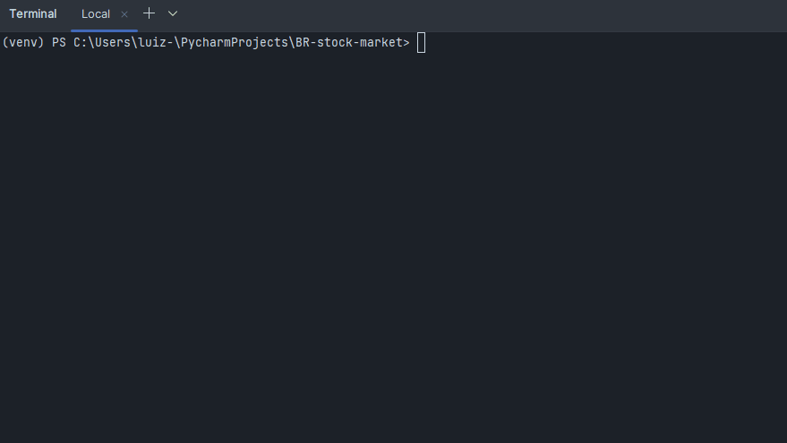

# Brazilian most valuable stocks 

## Version 1.0.1

## Description

The tool is a CLI app developed to web scrap financial indicators and generate the twenty most valuable stocks.
Twenty stocks per month are a reasonable number to diversify your stocks' wallet.
An .xlsx file is generated at the end with the stocks.

## Getting Started

The quickest way to get started with the tool is cloning this repo and running the main script:

```console
user@admin:~$ python3 main.py
```

You can also clone this repository and generate executable with pyinstaller.

```console
user@admin:~$ pyinstaller --onefile --noconsole -n most_valuable_stocks .\main.py
```




This will open the CLI tool and generate the stocks.
The indicators used for the analysis are:

| Indicators                                                           | Advantage                                                                 |
|----------------------------------------------------------------------|---------------------------------------------------------------------------|
| Avoid all `Financial Volume` (%) less than 1.000.000                 | More financial volume means easier buying and selling stocks.             | 
| Avoid companies with negative `EBIT Margin` (%)                      | Negative EBIT Margin means no profit operation.                           |
| Sort from the cheapest to expensive stocks `EV EBIT`                 | From EV EBIT indicators it is possible to get the cheapest stocks.        |
| Remove stocks from the same company with less `Financial Volume` (%) | Only maintains stocks from the same company with higher financial volume. |
| Remove stocks in `bankruptcy`                                        | Analyse indicator and avoid companies in bankruptcy.                      |

This way you get the cheapest stocks, with the highest financial volumes and not in bankruptcy.
